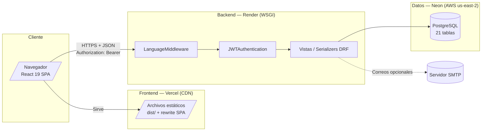
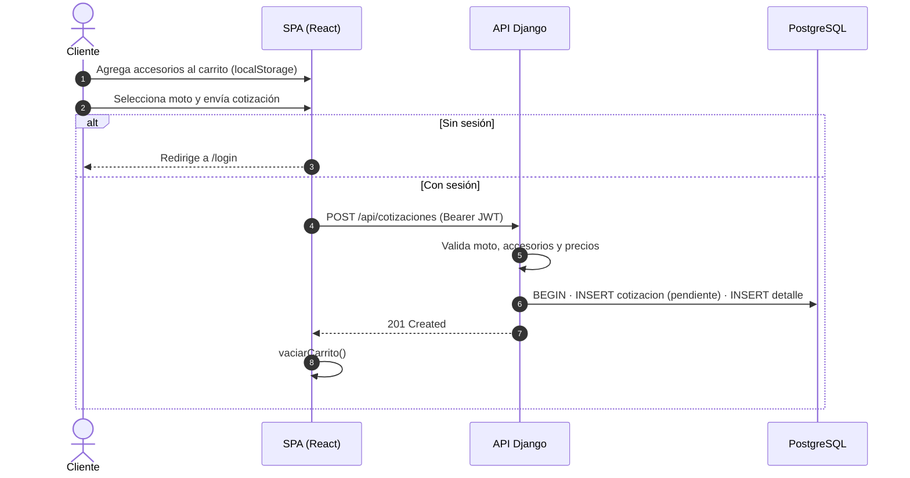

# 02 — Arquitectura

## 1. Arquitectura general

MotoPreview sigue una arquitectura **cliente-servidor desacoplada** en tres capas:

- **Capa de presentación:** SPA React servida estáticamente desde Vercel.
- **Capa de negocio/API:** Django REST Framework (stateless, JWT), servida con gunicorn en Render.
- **Capa de datos:** PostgreSQL (Neon) gestionada fuera de Django (`managed=False`).

La comunicación es puramente **HTTP + JSON**. No hay sesiones de servidor: el estado de usuario viaja en el JWT y el estado del carrito vive en `localStorage`.



> Archivo: [`diagramas/arquitectura-general.mmd`](diagramas/arquitectura-general.mmd)

## 2. Patrón de diseño empleado

| Patrón | Dónde | Detalle |
|---|---|---|
| **MVC / MVP** | Django | `models.py` (M), `views.py` (C), serializers + respuesta JSON (V) |
| **Capas (Layered)** | Backend | middleware → autenticación → permisos → vista → serializer → ORM |
| **Repositorio / DAO** | Frontend | `src/services/*` aíslan el acceso HTTP del resto de la UI |
| **Context Provider** | Frontend | `AuthContext`, `CartContext`, `ConnectionContext` como estado global |
| **Guard de rutas** | Frontend | `RutaProtegida` como componente de barrera (patrón *route guard*) |
| **Template Method** | Backend | Clases base `ResourceCollection` / `ResourceDetail` para CRUD genérico |
| **Strategy / Adapter** | Backend | `AccessorySerializer` adapta datos de `Product` a la vista del accesorio |
| **Proxy de API** | Frontend | `services/api.js` (axios) con interceptores de token y salud |
| **Fallback** | Frontend | `Visor3D`: si falla la carga GLTF → geometría de respaldo (`ErrorBoundary3D`) |
| **Soft delete** | Backend | DELETE de usuario → `estado_usuario = "bloqueado"` |
| **CQRS ligero** | Backend | Comandos de inventario con bloqueo pesado (`select_for_update`) e historiales |

## 3. Diagrama de componentes

```mermaid
flowchart TB
    subgraph FE["Frontend (React SPA)"]
        direction TB
        RTR["React Router v7<br/>App.jsx — rutas"]
        PUBL["Páginas públicas<br/>Catálogo · Carrito · Configurador<br/>Visualizador · MisCotizaciones"]
        AUTHW["Páginas de auth<br/>Login · Registro · Recuperar<br/>Restablecer · VerificarCorreo"]
        ADMW["Panel admin<br/>Dashboard · Inventario · Cotizaciones<br/>Reportes · Accesorios · Usuarios · Tienda"]

        subgraph CTX["Contextos"]
            AC["AuthContext<br/>sesión + JWT"]
            CC["CartContext<br/>carrito local"]
            CN["ConnectionContext<br/>salud del backend"]
        end

        subgraph SVC["Services (axios)"]
            API["api.js<br/>interceptores"]
            S1["auth · motos · accesorios<br/>cotizaciones · inventario"]
            S2["usuarios · tiendas · compatibilidad<br/>modelos3d"]
        end

        subgraph COMP["Componentes compartidos"]
            SH["SiteHeader"]
            FT["Footer"]
            AL["AdminLayout"]
            RP["RutaProtegida"]
            V3["Visor3D (three.js)"]
            BC["BannerConexion"]
            MC["ModalConfirmacion"]
            AC2["AccesorioCard"]
        end

        RTR --> PUBL & AUTHW & ADMW
        PUBL & AUTHW & ADMW --> CTX
        CTX --> SVC
        SVC --> COMP
    end

    subgraph BE["Backend (Django REST)"]
        direction TB
        URLS["motopreview/urls.py<br/>~45 rutas"]
        MW["LanguageMiddleware<br/>i18n es/en"]
        AUTH["JWTAuthentication<br/>Bearer HS256"]
        SEC["security.py<br/>IsStoreStaff · IsStoreAdmin"]
        VW["api/views.py<br/>FBV + ResourceCollection/Detail"]
        SER["api/serializers.py<br/>24 serializers"]
        ERR["errors.py → {'error': ...}<br/>renderers.py → traducción"]
        INFRA["fields.py · i18n.py · security.py"]
    end

    subgraph DB[("PostgreSQL — Neon")]
        MODELS["api/models.py<br/>21 modelos · managed=False"]
    end

    API -->|"HTTPS JSON"| URLS
    URLS --> MW --> AUTH --> SEC --> VW
    VW --> SER
    SER --> ERR
    VW --> MODELS
    MODELS --> DB
```

> Archivo: [`diagramas/componentes.mmd`](diagramas/componentes.mmd)

## 4. Capas del backend (recorrido de una petición)

```
Petición HTTP
   │
   ├─ 1. CorsMiddleware            → cabeceras CORS / preflight
   ├─ 2. CommonMiddleware           → normalización de URL
   ├─ 3. LanguageMiddleware         → idioma (?lang / X-Language / cookie mp_lang)
   │
   ├─ 4. URL resolver (urls.py)     → vista
   ├─ 5. JWTAuthentication          → Authorization: Bearer → usuario
   ├─ 6. Permission (security.py)   → AllowAny / IsAuthenticated / IsStoreStaff / IsStoreAdmin
   ├─ 7. Vista (views.py)           → lógica de negocio + ORM (PostgreSQL)
   ├─ 8. Serializer                 → validación y transformación
   │
   └─ 9. TranslatedJSONRenderer     → traduce claves de mensaje según idioma
       api_exception_handler        → {"error": detalle} ante excepciones
```

Notas:
- Solo **3 apps** instaladas (`corsheaders`, `rest_framework`, `api`): no hay `admin`, `sessions` ni `auth` de Django.
- Solo **3 middlewares**: no hay `SessionMiddleware` ni `CsrfViewMiddleware` → API **totalmente stateless**.
- `DEBUG=false` por defecto.

## 5. Capas del frontend (recorrido de una pantalla)

```
Ruta (App.jsx)
  → RutaProtegida (sesión / roles)          [si aplica]
    → Página (pages/*)
      → Contexto (Auth / Cart / Connection)
        → Service (services/*.js)
          → api.js (axios + interceptor Authorization)
            → Backend /api/...
```

Componentes de apoyo:
- `BannerConexion`: se muestra cuando `ConnectionContext` detecta el backend caído (evento `backend:offline`).
- `SiteHeader` / `Footer`: chrome público (contador del carrito, acceso a Panel según rol).
- `AdminLayout`: shell del panel con sidebar condicional por rol y `<Outlet />`.

## 6. Decisiones y patrones clave del dominio

| Tema | Decisión |
|---|---|
| **Mapeo de BD heredada** | `DatabaseModel` con `managed=False` + `db_table`: Django **no** genera migraciones; el esquema se administra con SQL directo. |
| **Enums nativos de PostgreSQL** | `PostgreSQLEnumField` hace cast `::tipo` en el placeholder para `plan_estado_enum`, `tienda_estado_enum`, `usuario_estado_enum`, `inventario_estado_enum`, `cotizacion_estado_enum`. |
| **Accesorio = envoltorio de Producto** | `AccessorySerializer` lee/escribe `Product` en paralelo (`create`/`update` transaccionales). |
| **Un rol por usuario** | `update_user_role()` hace `DELETE` + `INSERT` crudo sobre `usuario_rol` (PK compuesta). |
| **Sin Django auth** | `User` propio con `password_hash` (bcrypt) + JWT firmado con `JWT_SECRET`. |
| **Límites de plan** | Se validan en servidor al crear productos de inventario (403) y al registrar staff (403). |
| **Consurrencia** | `select_for_update()` en movimientos de inventario y cambio de estado de cotizaciones. |
| **Respuesta anti-enumeración** | `forgot-password` siempre responde 200 con mensaje genérico. |
| **Health check** | `GET /api/health` → `{"ok": true, "database_configured": bool}`; consumido por el frontend cada 10 s. |

## 7. Flujo de datos de una cotización (resumen)



---

**Anterior:** [01 — Visión general](01-vision-general.md) · **Siguiente:** [03 — Modelo de datos](03-modelo-datos.md)
