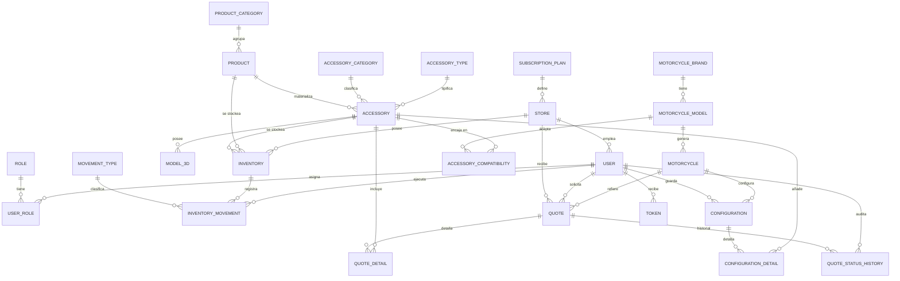

# 03 — Modelo de Datos (Tablas)

La base de datos es **PostgreSQL (Neon)** y su esquema **no está gestionado por Django**: los 21 modelos heredan de `DatabaseModel` (abstracta con `managed = False`), por lo que Django **no genera ni ejecuta migraciones**. Las tablas se crean/modifican con SQL directo.

**Convenciones:**
- Claves primarias: `UUID` (`uuid.uuid4`) salvo la intermedia `usuario_rol` (PK compuesta).
- Nombres de columnas en **español**.
- Enums: tipos `enum` nativos de PostgreSQL (`*_enum`), mapeados con `PostgreSQLEnumField`.
- Relaciones: `on_delete=DO_NOTHING` (las FK no borran en cascada; la integridad la mantiene la BD).

---

## 1. Diagrama Entidad–Relación

> Archivo completo (con atributos): [`diagramas/erd.mmd`](diagramas/erd.mmd)

---

## 2. Tablas de referencia (catálogos)

### `rol`
| Columna | Tipo | Restricción |
|---|---|---|
| `id_rol` | UUID | PK |
| `nombre_rol` | Text | — |

Semilla: `Administrador` (`...0001`), `Vendedor` (`...0002`), `Cliente` (`...0003`).

### `plan_subscripcion`
| Columna | Tipo | Restricción / nota |
|---|---|---|
| `id_plan` | UUID | PK |
| `plan_nombre` | Text | — |
| `plan_descripcion` | Text | null |
| `precio_mensual` | Decimal(10,2) | — |
| `limite_productos` | Int | null → límite aplicado en `POST /api/inventario` |
| `limite_usuarios` | Int | null → límite aplicado en `POST /api/auth/register` |
| `plan_estado` | `plan_estado_enum` | `activo` \| `inactivo` \| `suspendido` (default `activo`) |

### `categoria_accesorio`
| Columna | Tipo |
|---|---|
| `id_categoria` | UUID (PK) |
| `cat_nombre` | Text |
| `cat_descripcion` | Text (null) |

### `categoria_producto`
| Columna | Tipo |
|---|---|
| `id_categoria_producto` | UUID (PK) |
| `nombre` | Text |
| `descripcion` | Text (null) |

### `tipo_accesorio`
| Columna | Tipo |
|---|---|
| `id_tipo` | UUID (PK) |
| `nombre` | Text |
| `descripcion` | Text (null) |

### `marca_moto`
| Columna | Tipo |
|---|---|
| `id_marca` | UUID (PK) |
| `marca_nombre` | Text |
| `marca_pais` | Text (null) |

### `tipo_movimiento`
| Columna | Tipo |
|---|---|
| `id_tipomov` | UUID (PK) |
| `tipomov_nombre` | Text → la vista compara en minúsculas: **`entrada`** (suma) / **`salida`** (resta) |
| `descripcion_tipomov` | Text (null) |

Semilla del frontend: `Entrada` (`cccc...0001`), `Salida` (`cccc...0002`), `Ajuste` (`cccc...0003`).

---

## 3. Tablas de productos y accesorios

### `producto`
| Columna | Tipo | Restricción / nota |
|---|---|---|
| `id_producto` | UUID | PK |
| `nombre` | Text | **Nombre visible del accesorio** |
| `descripcion` | Text | null |
| `estado` | Char(50) | default `disponible` |
| `id_categoria_producto` | UUID | FK → `categoria_producto` |
| `imagen` | Text | null |
| `codigo_sku` | Text | **UNIQUE**, null |
| `precio` | Decimal(10,2) | null; **debe existir** para poder cotizar el accesorio |

### `accesorio`
| Columna | Tipo | Restricción / nota |
|---|---|---|
| `id_accesorio` | UUID | PK |
| `id_categoria` | UUID | FK → `categoria_accesorio` |
| `id_producto` | UUID | FK → `producto` (**nombre, precio, SKU e imagen se derivan de aquí**) |
| `id_tipo` | UUID | FK → `tipo_accesorio` |
| `peso` | Decimal(6,2) | null (kg) |
| `color` | Text | null |

> Patrón importante: `AccessorySerializer` sincroniza `accesorio` **y** `producto` en `create`/`update`; en lectura expone `acc_nombre`, `acc_precio`, `codigo_sku`, `imagen`, `acc_estado` provenientes de `producto`.

### `modelo_3d`
| Columna | Tipo | Nota |
|---|---|---|
| `id_modelo3d` | UUID | PK |
| `id_accesorio` | UUID | FK → `accesorio` |
| `url_modelo3d` | Text | URL del archivo **GLTF/GLB** |
| `formato_archivo` | Text | null |
| `estado_visualizacion` | Text | null |
| `modelo3d_fecha` | Date | default hoy |
| `modelo3d_observaciones` | Text | null |

---

## 4. Tablas de motos

### `modelo_moto`
| Columna | Tipo | Nota |
|---|---|---|
| `id_modelo_moto` | UUID | PK |
| `id_marca` | UUID | FK → `marca_moto` |
| `modelo_nombre` | Text | — |
| `modelo_descripcion` | Text | null |
| `cilindraje` | Text | null |

### `moto`
| Columna | Tipo | Nota |
|---|---|---|
| `id_moto` | UUID | PK |
| `id_modelo_moto` | UUID | FK → `modelo_moto` |
| `moto_anio` | Int | null |
| `moto_version` | Text | null |
| `moto_imagen` | Text | null (usada en el configurador) |

### `accesorio_modelo_moto` (compatibilidad)
| Columna | Tipo | Restricción |
|---|---|---|
| `id_compatibilidad` | UUID | PK |
| `id_accesorio` | UUID | FK → `accesorio`, NOT NULL |
| `id_modelo_moto` | UUID | FK → `modelo_moto`, NOT NULL |
| `anio_desde` | Int | null (rango de años) |
| `anio_hasta` | Int | null |

**`UNIQUE (id_accesorio, id_modelo_moto)`** → un `POST /api/compatibilidad` duplicado devuelve **409**.

---

## 5. Tablas de tiendas y usuarios

### `tienda`
| Columna | Tipo | Restricción / nota |
|---|---|---|
| `id_tienda` | UUID | PK |
| `id_plan` | UUID | FK → `plan_subscripcion` |
| `nombre_tienda` | Text | — |
| `nit` | Text | **UNIQUE**, null |
| `direccion_tienda` | Text | — |
| `telefono_tienda` | Text | — |
| `email_tienda` | Text | null |
| `fecha_afiliacion` | Date | default hoy |
| `estado_tienda` | `tienda_estado_enum` | `activa` \| `inactiva` \| `suspendida` |

### `usuario`
| Columna | Tipo | Restricción / nota |
|---|---|---|
| `id_usuario` | UUID | PK |
| `id_tienda` | UUID | FK → `tienda`, null (los clientes pueden no tener tienda) |
| `usu_nombre` | Text | — |
| `usu_email` | Text | **UNIQUE** |
| `password_hash` | Text | **bcrypt** `gensalt(rounds=12)` |
| `fecha_registro` | Date | default hoy |
| `estado_usuario` | `usuario_estado_enum` | `activo` \| `inactivo` \| `bloqueado` |
| `reset_token` | Text | SHA-256 del token de recuperación |
| `reset_token_expira` | DateTime | caduca en **1 hora** |
| `email_verificado` | Bool | default `False` |
| `verificacion_token` | Text | token de verificación de correo |

> **No hereda de `AbstractUser`**: no existe `username`, no hay Django auth. Propiedades útiles: `is_authenticated=True`, `id_rol` (primer rol), `role_ids`.

### `usuario_rol` (intermedia N:M)
| Columna | Tipo |
|---|---|
| `id_usuario` | UUID — parte de la **PK compuesta** (`CompositePrimaryKey`) |
| `id_rol` | UUID — parte de la **PK compuesta** |

En la práctica **un rol por usuario**: `update_user_role()` ejecuta `DELETE` + `INSERT` crudos.

---

## 6. Tablas de inventario

### `inventario`
| Columna | Tipo | Restricción / nota |
|---|---|---|
| `id_inventario` | UUID | PK |
| `id_tienda` | UUID | FK → `tienda` |
| `id_producto` | UUID | FK → `producto` |
| `id_accesorio` | UUID | FK → `accesorio` (resuelto desde el producto) |
| `stock_actual` | Int | default 0 |
| `stock_minimo` | Int | default 0 |
| `estado_inventario` | `inventario_estado_enum` | `normal` \| `bajo` \| `agotado` (recalculado) |
| `fecha_actualizacion` | Date | default hoy |
| `precio` | Decimal(10,2) | null (precio propio de la tienda) |

**`UNIQUE (id_tienda, id_producto)`** → un registro duplicado devuelve **409**.
Regla de estado: `agotado` si `stock_actual ≤ 0`; `bajo` si `≤ stock_minimo`; si no, `normal`.

### `movimiento_inventario`
| Columna | Tipo | Nota |
|---|---|---|
| `id_movimiento` | UUID | PK |
| `id_inventario` | UUID | FK → `inventario` |
| `id_tipomov` | UUID | FK → `tipo_movimiento` |
| `id_usuario` | UUID | FK → `usuario` (autor del movimiento) |
| `mov_cantidad` | Int | **positivo** en entrada, **negativo** en salida |
| `fecha_movimiento` | DateTime | default `timezone.now` |
| `observaciones` | Text | null |

---

## 7. Tablas de cotizaciones

### `cotizacion`
| Columna | Tipo | Restricción / nota |
|---|---|---|
| `id_cotizacion` | UUID | PK |
| `id_tienda` | UUID | FK → `tienda` |
| `id_usuario` | UUID | FK → `usuario` (solicitante) |
| `id_moto` | UUID | FK → `moto` |
| `fecha_solicitud` | DateTime | default `timezone.now` |
| `coti_estado` | `cotizacion_estado_enum` | `pendiente` (default) \| `aprobada` \| `rechazada` \| `completada` |
| `total` | Decimal(10,2) | default 0; suma de subtotales |
| `coti_observaciones` | Text | null |
| `nombre_configuracion` | Text | null |

### `detalle_cotizacion`
| Columna | Tipo | Nota |
|---|---|---|
| `id_detalle_cotizacion` | UUID | PK |
| `id_cotizacion` | UUID | FK → `cotizacion` |
| `id_accesorio` | UUID | FK → `accesorio` |
| `cantidad` | Int | ≥ 1 |
| `precio_unitario` | Decimal(10,2) | tomado de `producto.precio` al crear |
| `subtotal` | Decimal(10,2) | `cantidad × precio_unitario` |

### `cotizacion_estado_hist`
| Columna | Tipo | Nota |
|---|---|---|
| `id_hist` | UUID | PK |
| `id_cotizacion` | UUID | FK → `cotizacion`, NOT NULL |
| `estado` | Char(50) | estado registrado |
| `fecha` | DateTime | default ahora |
| `id_usuario` | UUID | FK → `usuario`, NOT NULL (quien cambió el estado) |

---

## 8. Tablas sin endpoint expuesto (modelos reserva)

Estas tablas existen en los modelos pero **no tienen serializer ni ruta** en la API actual:

### `configuracion`
| Columna | Tipo |
|---|---|
| `id_configuracion` | UUID (PK) |
| `id_usuario` | FK → `usuario` |
| `id_moto` | FK → `moto` |
| `nombre` | Char(100) |

### `configuracion_detalle`
| Columna | Tipo |
|---|---|
| `id_detalle` | UUID (PK) |
| `id_configuracion` | FK → `configuracion` |
| `id_accesorio` | FK → `accesorio` |
| `cantidad` | Int (default 1) |

### `token`
| Columna | Tipo |
|---|---|
| `id_token` | UUID (PK) |
| `id_usuario` | FK → `usuario` |
| `tipo` | Char(50) |
| `hash` | Text |
| `expira_en` | DateTime |
| `usado` | Bool (default False) |

---

## 9. Tablas por dominio (mapa rápido)

| Dominio | Tablas |
|---|---|
| Seguridad / acceso | `usuario`, `rol`, `usuario_rol` |
| Suscripciones | `tienda`, `plan_subscripcion` |
| Catálogo de accesorios | `producto`, `categoria_producto`, `accesorio`, `categoria_accesorio`, `tipo_accesorio` |
| Visualización 3D | `modelo_3d` |
| Motos y compatibilidad | `marca_moto`, `modelo_moto`, `moto`, `accesorio_modelo_moto` |
| Inventario | `inventario`, `movimiento_inventario`, `tipo_movimiento` |
| Cotizaciones | `cotizacion`, `detalle_cotizacion`, `cotizacion_estado_hist` |
| Reservas (sin API) | `configuracion`, `configuracion_detalle`, `token` |

**Total: 21 tablas.**

---

## 10. Enumeraciones (enums de PostgreSQL)

| Enum | Valores | Tabla |
|---|---|---|
| `plan_estado_enum` | `activo`, `inactivo`, `suspendido` | `plan_subscripcion` |
| `tienda_estado_enum` | `activa`, `inactiva`, `suspendida` | `tienda` |
| `usuario_estado_enum` | `activo`, `inactivo`, `bloqueado` | `usuario` |
| `inventario_estado_enum` | `normal`, `bajo`, `agotado` | `inventario` |
| `cotizacion_estado_enum` | `pendiente`, `aprobada`, `rechazada`, `completada` | `cotizacion` |

> Los estados de *tipo* de movimiento y de *rol* **no** son enums: son filas de `tipo_movimiento` y `rol`.

---

**Anterior:** [02 — Arquitectura](02-arquitectura.md) · **Siguiente:** [04 — API REST](04-api-rest.md)
