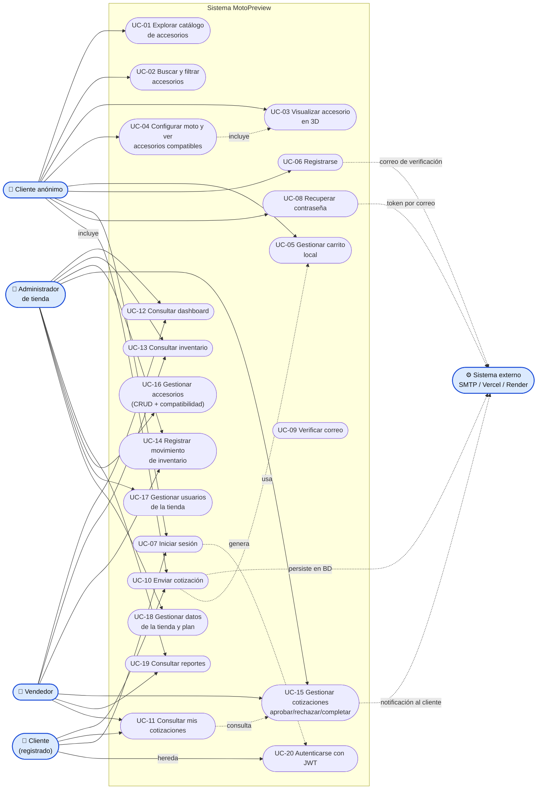

# 05 — Casos de Uso

## 1. Actores

| Actor | Tipo | Descripción |
|---|---|---|
| **Cliente anónimo** | Principal | Visitante sin sesión: navega el catálogo, prueba el configurador y el visor 3D |
| **Cliente registrado** | Principal | Cliente con cuenta: arma el carrito, envía cotizaciones y consulta su estado |
| **Vendedor** | Principal | Staff de tienda: revisa inventario, registra movimientos y gestiona cotizaciones |
| **Administrador de tienda** | Principal | Todo lo del vendedor **más** catálogo, usuarios, datos de la tienda y reportes |
| **Sistema externo** | Secundario | SMTP (correos), Vercel (SPA), Render (API), Neon (BD) |
| **Sistema MotoPreview** | Secundario | El propio software (FRONTEND + API + BD) |

> Los clientes registrados también pueden ver `/mis-cotizaciones`; el vendedor hereda los casos de consulta pública.

---

## 2. Diagrama de casos de uso

> Archivo: [`diagramas/casos-de-uso.mmd`](diagramas/casos-de-uso.mmd)

---

## 3. Especificación de casos de uso

### UC-01 — Explorar catálogo
| | |
|---|---|
| **Actor** | Cliente anónimo / registrado |
| **Precondición** | Ninguna |
| **Flujo principal** | Visita `/` → se cargan `GET /accesorios` y `GET /categorias` → se muestra el grid (8 por página) con `AccesorioCard` |
| **Flujo alternativo** | Error de API → se muestra mensaje de error en la página |
| **Postcondición** | El usuario conoce el catálogo disponible |
| **Caso relacionado** | `Catalogo.jsx` |

### UC-02 — Buscar y filtrar accesorios
| | |
|---|---|
| **Actor** | Cliente |
| **Precondición** | UC-01 cargado |
| **Flujo principal** | Seleccionar pestaña de categoría **o** escribir en el buscador → filtrado client-side sobre `acc_nombre`, `acc_descripcion`, `codigo_sku` → paginación Anterior/Siguiente |
| **Postcondición** | Lista acotada de resultados |

### UC-03 — Visualizar accesorio en 3D
| | |
|---|---|
| **Actor** | Cliente |
| **Precondición** | El accesorio existe |
| **Flujo principal** | Abre `/visualizador/:id` → `GET /accesorios/:id` + `GET /modelos-3d/accesorio/:id` → `Visor3D` carga el GLTF con `useGLTF` → el usuario rota/zoom con `OrbitControls` |
| **Flujo alternativo A** | Sin modelo 3D → se muestra geometría de referencia (`ModeloReemplazo`) y aviso "aún no tiene un modelo 3D real" |
| **Flujo alternativo B** | URL del modelo caída → `ErrorBoundary3D` captura el error y cae al modelo de reemplazo |
| **Postcondición** | El usuario visualiza el producto antes de cotizar |

### UC-04 — Configurar moto y ver accesorios compatibles
| | |
|---|---|
| **Actor** | Cliente |
| **Precondición** | Existencia de motos y compatibilidades en BD |
| **Flujo principal** | `/configurador` → seleccionar moto → `GET /compatibilidad/modelo/:id` → lista filtrada por chips de categoría → botón **+** agrega al carrito → barra inferior con total y enlace a `/carrito` |
| **Postcondición** | Carrito con accesorios compatibles con la moto elegida |

### UC-05 — Gestionar carrito local
| | |
|---|---|
| **Actor** | Cliente |
| **Precondición** | Ninguna (funciona sin sesión) |
| **Flujo principal** | `CartContext.agregarItem` / `actualizarCantidad` (mínimo 1) / `eliminarItem` / `vaciarCarrito`; persistencia en `localStorage['carrito']`; contador en `SiteHeader` |
| **Postcondición** | Carrito listo para enviar (UC-10) |

### UC-06 — Registrarse
| | |
|---|---|
| **Actor** | Cliente anónimo |
| **Precondición** | Email no registrado |
| **Flujo principal** | `/registro` → `POST /auth/register` con `ROL_CLIENTE` y `TIENDA_PRINCIPAL` → login automático → redirige a `/` |
| **Flujo alternativo A** | Email duplicado → **409** → mensaje de error |
| **Flujo alternativo B** | Contraseña < 8 → **400** |
| **Postcondición** | Cuenta creada con `email_verificado=false` y token de verificación enviado (UC-09) |

### UC-07 — Iniciar sesión
| | |
|---|---|
| **Actor** | Cualquier usuario |
| **Precondición** | Cuenta existente y `estado_usuario = activo` |
| **Flujo principal** | `/login` → `POST /auth/login` → se guarda token + usuario en `localStorage` → **redirección por rol**: admin/vendedor → `/admin`, otro → `/` |
| **Flujo alternativo A** | Credenciales inválidas → **401** → "Credenciales inválidas" |
| **Flujo alternativo B** | Usuario inactivo/bloqueado → **403** |
| **Postcondición** | Sesión JWT vigente 8 h |

### UC-08 — Recuperar contraseña
| | |
|---|---|
| **Actor** | Cliente |
| **Precondición** | Ninguna |
| **Flujo principal** | `/recuperar` → `POST /auth/forgot-password` → servidor guarda SHA-256 del token (1 h) y envía correo → `/restablecer/:token` → `POST /auth/reset-password` → redirect a `/login` |
| **Postcondición** | Contraseña actualizada, tokens limpiados |

### UC-09 — Verificar correo
| | |
|---|---|
| **Actor** | Cliente |
| **Flujo principal** | Abre el enlace `/verificar/:token` → `GET /auth/verificar/:token` → `email_verificado = true` → estado `exito` |
| **Alternativo** | Token inválido → estado `error` (400) |

### UC-10 — Enviar cotización
| | |
|---|---|
| **Actor** | Cliente registrado |
| **Precondición** | Carrito con items y moto seleccionada |
| **Flujo principal** | `/carrito` → elegir moto → **Enviar** → `POST /cotizaciones` (validación de precios, cálculo de subtotales y total) → `vaciarCarrito()` → pantalla "¡Cotización enviada!" |
| **Flujo alternativo A** | Sin sesión → redirige a `/login` |
| **Flujo alternativo B** | Sin moto seleccionada → error en pantalla |
| **Flujo alternativo C** | Algún accesorio sin precio → **400** |
| **Postcondición** | Cotización creada en estado **`pendiente`** con detalle e historial |
| **Ver** | [Flujo](06-flujos.md) · [Secuencia](06-flujos.md#2-diagrama-de-secuencia--crear-cotización) |

### UC-11 — Consultar mis cotizaciones
| | |
|---|---|
| **Actor** | Cliente registrado |
| **Precondición** | Sesión activa (`RutaProtegida`) |
| **Flujo principal** | `/mis-cotizaciones` → `GET /cotizaciones` → filtro por `id_usuario` → tarjetas expandibles con estado, detalle y observaciones |

### UC-12 — Consultar dashboard
| | |
|---|---|
| **Actor** | Vendedor / Administrador |
| **Precondición** | Rol staff y sesión |
| **Flujo principal** | `/admin` → `GET /inventario` + `GET /cotizaciones` filtrados por tienda → KPIs (productos, stock bajo/agotado, cotizaciones pendientes), barras CSS, últimas 4 cotizaciones y alerta de reabastecimiento |

### UC-13 — Consultar inventario
| | |
|---|---|
| **Actor** | Vendedor / Administrador |
| **Flujo principal** | `/admin/inventario` → tabla con accesorio, SKU, stock actual/mínimo y badge de estado (`normal`/`bajo`/`agotado`) |

### UC-14 — Registrar movimiento de inventario
| | |
|---|---|
| **Actor** | Vendedor / Administrador |
| **Precondición** | Rol staff; registro de inventario existente |
| **Flujo principal** | Modal "Registrar movimiento" → tipo (`Entrada`/`Salida`/`Ajuste`) + cantidad + observaciones → `POST /inventario/movimiento` → recarga de la tabla |
| **Flujo alternativo A** | Stock quedaría negativo → **400** → mensaje |
| **Flujo alternativo B** | Límite de `limite_productos` alcanzado al dar de alta → **403** |
| **Postcondición** | `stock_actual` y `estado_inventario` actualizados + fila en `movimiento_inventario` |
| **Ver** | [Flujo](06-flujos.md#4-diagrama-de-flujo--movimiento-de-inventario) |

### UC-15 — Gestionar cotizaciones
| | |
|---|---|
| **Actor** | Vendedor / Administrador |
| **Precondición** | Rol staff; cotizaciones de **su tienda** |
| **Flujo principal** | `/admin/cotizaciones` → tarjeta expandible (moto, cliente, fecha, total) → acciones por estado: `pendiente` → **Rechazar**/**Aprobar**; `aprobada` → **Marcar como completada** → `PUT /cotizaciones/:id/estado` |
| **Postcondición** | Estado nuevo + fila en `cotizacion_estado_hist` + correo al cliente |

### UC-16 — Gestionar accesorios y compatibilidad *(solo Admin)*
| | |
|---|---|
| **Actor** | Administrador |
| **Precondición** | `id_rol = ROL_ADMIN` (doble `RutaProtegida`) |
| **Flujo principal** | `/admin/accesorios` → alta/edición (nombre, categoría, descripción, precio, peso, SKU, estado, imagen) → `POST/PUT /accesorios` → al editar se marcan/quitan compatibilidades con `POST /compatibilidad` y `DELETE /compatibilidad/:id` |
| **Postcondición** | Accesorio publicado y con matriz de compatibilidad actualizada |

### UC-17 — Gestionar usuarios de la tienda *(solo Admin)*
| | |
|---|---|
| **Actor** | Administrador |
| **Flujo principal** | `/admin/usuarios` → crear (`POST /auth/register` como admin), editar (nombre, rol, estado, contraseña) o **Desactivar** con `ModalConfirmacion` → `DELETE /usuarios/:id` (soft delete → `bloqueado`) |
| **Restricciones** | No puede desactivarse a sí mismo; no muestra usuarios ya bloqueados; límite `limite_usuarios` del plan |

### UC-18 — Gestionar datos de la tienda y plan *(solo Admin)*
| | |
|---|---|
| **Actor** | Administrador |
| **Flujo principal** | `/admin/tienda` → consulta `GET /tiendas/:id` → ve plan (nombre, precio, límites) e info general → modo edición → `PUT /tiendas/:id` (nombre, NIT, dirección, teléfono, email) |

### UC-19 — Consultar reportes
| | |
|---|---|
| **Actor** | Vendedor / Administrador |
| **Flujo principal** | `/admin/reportes` → rango "Este mes" / "Todo el tiempo" → métricas calculadas en cliente: ventas confirmadas (`aprobada`+`completada`), total de cotizaciones, tasa de aprobación %, conteo por estado y **Top-5** accesorios más cotizados |

### UC-20 — Autenticarse con JWT *(caso del sistema)*
| | |
|---|---|
| **Actor** | Sistema MotoPreview |
| **Precondición** | Cabecera `Authorization: Bearer <token>` |
| **Flujo principal** | `JWTAuthentication` decodifica HS256 (exige `exp`) → carga `usuario` + tienda → verifica `estado_usuario = activo` → refresca `id_rol`/`id_tienda` desde `usuario_rol` |
| **Flujo alternativo A** | Formato inválido o expirado → **401** |
| **Flujo alternativo B** | Sin cabecera → usuario anónimo (`AnonymousPrincipal`) |

---

## 4. Matriz actores × casos de uso

| Caso | Anónimo | Cliente | Vendedor | Admin |
|---|:-:|:-:|:-:|:-:|
| UC-01 Explorar catálogo | ✔ | ✔ | ✔ | ✔ |
| UC-02 Buscar/filtrar | ✔ | ✔ | ✔ | ✔ |
| UC-03 Visualizador 3D | ✔ | ✔ | ✔ | ✔ |
| UC-04 Configurador | ✔ | ✔ | ✔ | ✔ |
| UC-05 Carrito | ✔ | ✔ | ✔ | ✔ |
| UC-06 Registrarse | ✔ | — | — | — |
| UC-07 Login | ✔ | ✔ | ✔ | ✔ |
| UC-08 Recuperar contraseña | ✔ | ✔ | ✔ | ✔ |
| UC-09 Verificar correo | ✔ | ✔ | — | — |
| UC-10 Enviar cotización | ✖ | ✔ | ✔ | ✔ |
| UC-11 Mis cotizaciones | ✖ | ✔ | ✔ | ✔ |
| UC-12 Dashboard | ✖ | — | ✔ | ✔ |
| UC-13 Inventario | ✖ | — | ✔ | ✔ |
| UC-14 Movimientos | ✖ | — | ✔ | ✔ |
| UC-15 Gestionar cotizaciones | ✖ | — | ✔ | ✔ |
| UC-16 CRUD accesorios | ✖ | — | — | ✔ |
| UC-17 Gestión usuarios | ✖ | — | — | ✔ |
| UC-18 Tienda y plan | ✖ | — | — | ✔ |
| UC-19 Reportes | ✖ | — | ✔ | ✔ |

---

**Anterior:** [04 — API REST](04-api-rest.md) · **Siguiente:** [06 — Diagramas de flujo](06-flujos.md)
