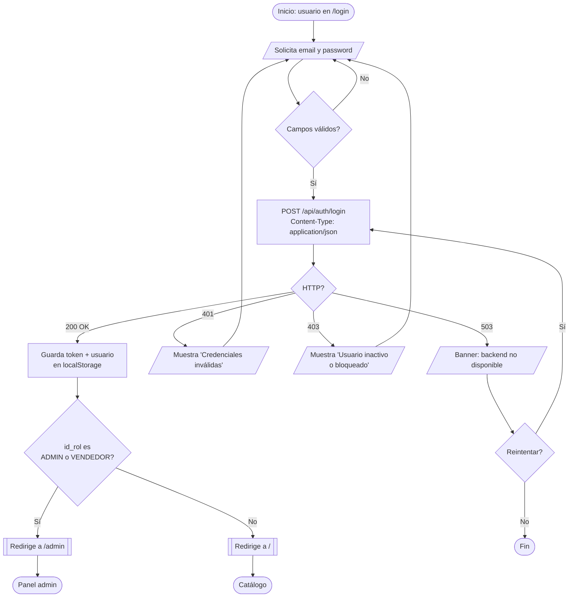
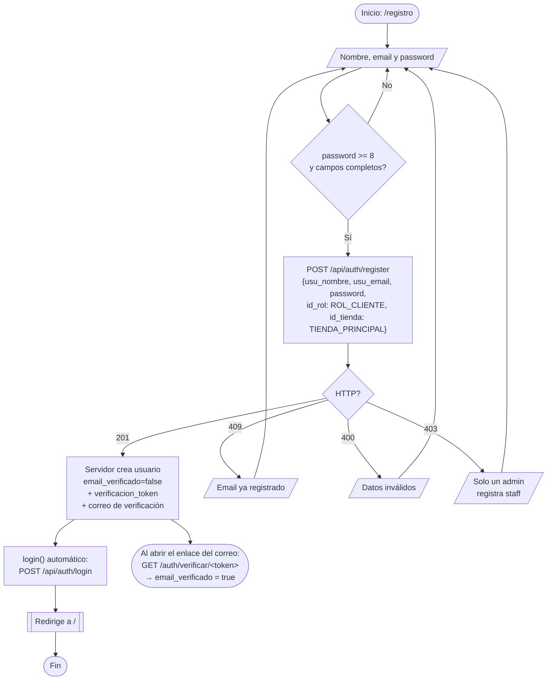
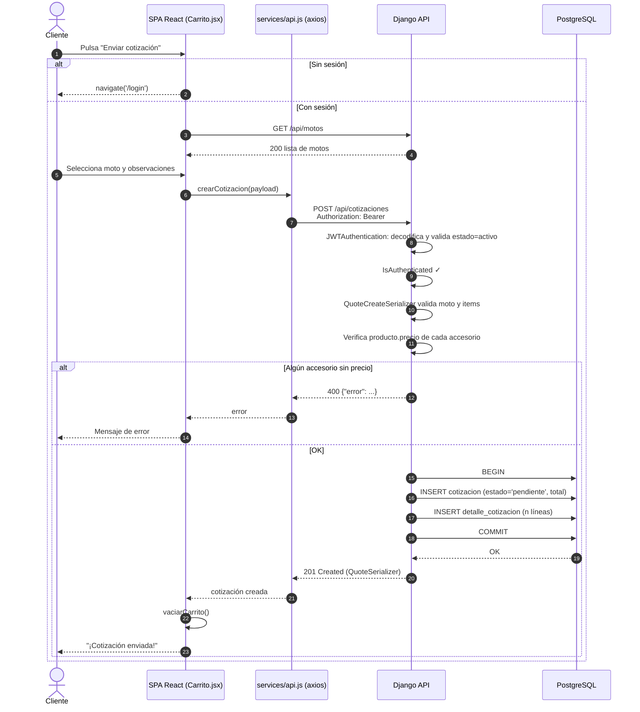
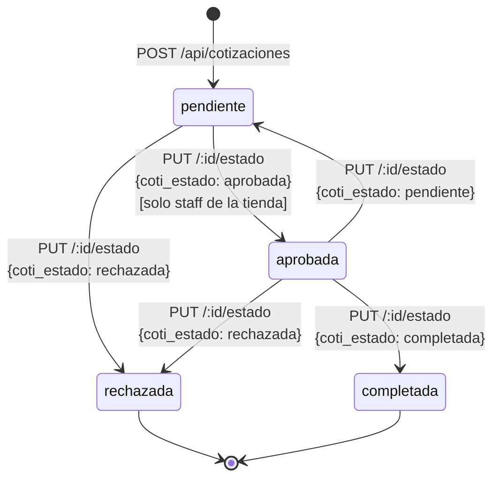
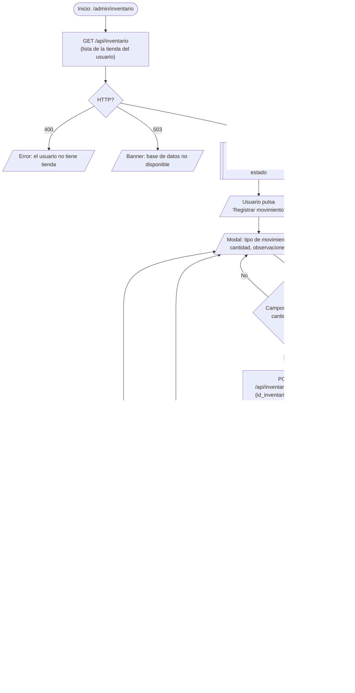
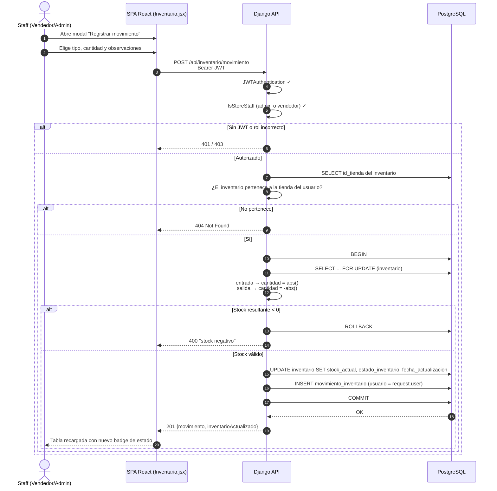
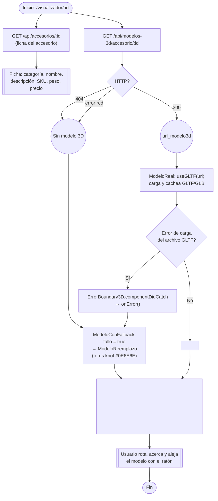
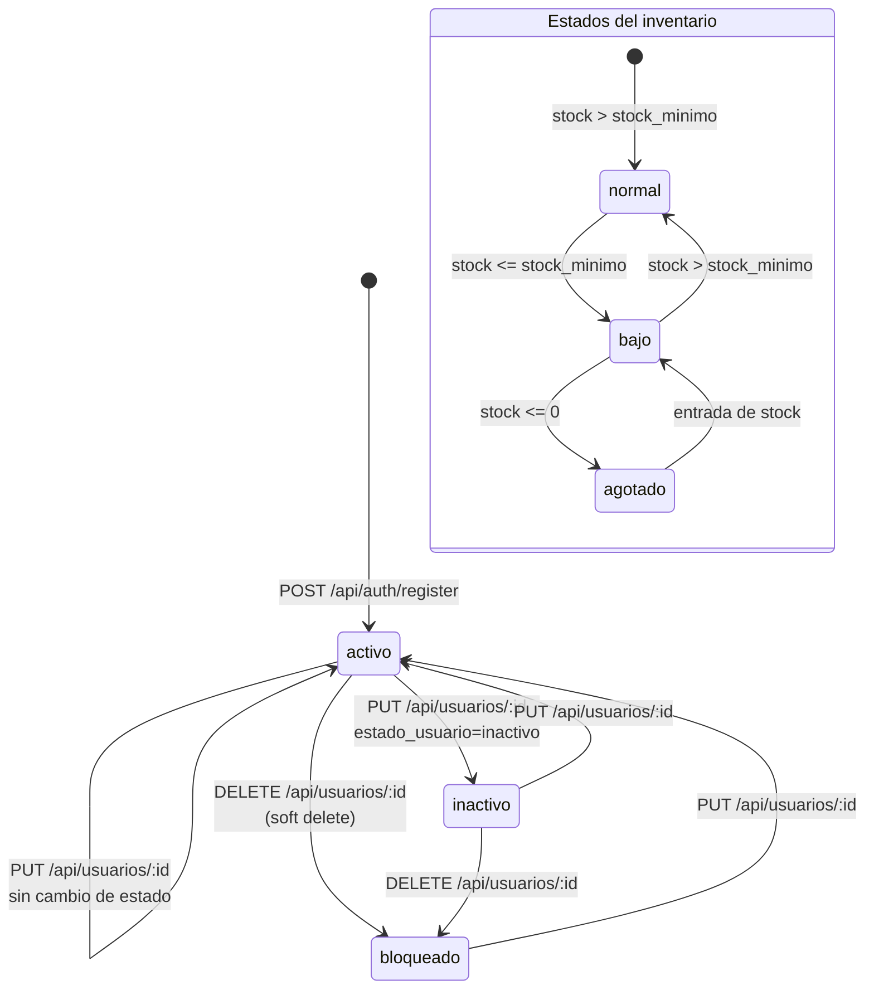
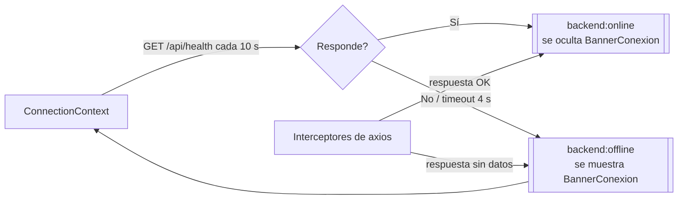

# 06 — Diagramas de Flujo y de Comportamiento

Todos los diagramas de esta sección también están disponibles como archivos `.mmd` en [`diagramas/`](diagramas/).

---

## 1. Diagrama de flujo — Iniciar sesión

> 📄 [`diagramas/flujo-login.mmd`](diagramas/flujo-login.mmd) · Código: `pages/auth/Login.jsx`, `context/AuthContext.jsx`, `views.login`



**Notas clave:**
- El JWT dura **8 h** (`JWT_LIFETIME_SECONDS=28800`); el interceptor de `api.js` limpia la sesión en **401**.
- La redirección por rol se decide en `Login.jsx` comparando `id_rol` con `ROL_ADMIN`/`ROL_VENDEDOR`.

---

## 1b. Diagrama de flujo — Registro

> 📄 [`diagramas/flujo-registro.mmd`](diagramas/flujo-registro.mmd) · Código: `pages/auth/Registro.jsx`, `views.register`



---

## 1c. Diagrama de flujo — Recuperación de contraseña

> 📄 [`diagramas/flujo-recuperar-password.mmd`](diagramas/flujo-recuperar-password.mmd) · Código: `RecuperarPassword.jsx`, `RestablecerPassword.jsx`, `VerificarCorreo.jsx`

```mermaid
flowchart TD
    A([Inicio: /recuperar]) --> B[/Email/]
    B --> C["POST /api/auth/forgot-password"]
    C --> D{HTTP?}
    D -- "200" --> E["Servidor (si el email existe):<br/>token aleatorio → SHA-256 en reset_token<br/>reset_token_expira = ahora + 1 h<br/>envía PASSWORD_RESET_URL?token=..."]
    D -- "503" --> F[/Aviso: correo no configurado/]
    F --> B
    D -- "400" --> G[/Error/]
    G --> B
    E --> H[[Mensaje genérico:<br/>'Si ese correo está registrado...'<br/>(anti-enumeración)]]
    H --> I([Usuario abre<br/>/restablecer/:token])
    I --> J[/Nueva contraseña x2/]
    J --> K{"Iguales y >= 8?"}
    K -- No --> J
    K -- Sí --> L["POST /api/auth/reset-password<br/>{token, password}"]
    L --> M{HTTP?}
    M -- "200" --> N["Servidor valida hash SHA-256 no expirado<br/>actualiza password_hash<br/>limpia reset_token y reset_token_expira"]
    N --> O[[Mensaje de éxito → /login<br/>tras 2.5 s]]
    M -- "400" --> P[/Token inválido o expirado/]
    P --> I
    O --> Q([Fin])
```

**Seguridad:** se guarda el **SHA-256** del token (no el token) y la respuesta es idéntica exista o no el correo.

---

## 2. Diagrama de flujo — Crear cotización

> 📄 [`diagramas/flujo-cotizacion.mmd`](diagramas/flujo-cotizacion.mmd) · Código: `pages/public/Carrito.jsx`, `context/CartContext.jsx`, `QuoteCollection`

```mermaid
flowchart TD
    A([Inicio: usuario pulsa '+']) --> B["CartContext.agregarItem(accesorio)<br/>persiste en localStorage['carrito']"]
    B --> C[[SiteHeader actualiza badge totalItems]]
    C --> D[/usuario abre la página del carrito/]
    D --> E{"¿Hay sesión?<br/>(AuthContext.usuario)"}
    E -- No --> F[[navigate('/login')]]
    F --> D
    E -- Sí --> G["Carga motos:<br/>GET /api/motos"]
    G --> H[/Selecciona una moto<br/>+ observaciones opcionales/]
    H --> I{Moto seleccionada?}
    I -- No --> J[/Error: 'Selecciona una moto'/]
    J --> H
    I -- Sí --> K["POST /api/cotizaciones<br/>{id_moto, coti_observaciones,<br/>items:[{id_accesorio, cantidad}]}<br/>Authorization: Bearer"]
    K --> L{HTTP?}
    L -- "400" --> M[/Accesorio sin precio<br/>o datos inválidos/]
    M --> H
    L -- "409" --> M
    L -- "201" --> N["Backend en transacción:<br/>· INSERT cotizacion (estado 'pendiente')<br/>· INSERT detalle_cotizacion (subtotal/total)"]
    N --> O["vaciarCarrito()"]
    O --> P[[Pantalla '¡Cotización enviada!']]
    P --> Q([Fin])

    subgraph ClienteAdmin["Gestión de la cotización (panel admin)"]
        R[[Cliente: /admin/cotizaciones]] --> S[/Pulsa Aprobar, Rechazar<br/>o Completar/]
        S --> T["PUT /api/cotizaciones/id/estado<br/>{coti_estado}"]
        T --> U["Backend:<br/>· select_for_update<br/>· UPDATE cotizacion<br/>· INSERT cotizacion_estado_hist<br/>· correo al cliente"]
        U --> V[[Lista recargada]]
    end
```

---

## 2b. Diagrama de secuencia — Crear cotización

> 📄 [`diagramas/secuencia-cotizacion.mmd`](diagramas/secuencia-cotizacion.mmd)



---

## 3. Estados de la cotización

> 📄 [`diagramas/estados-cotizacion.mmd`](diagramas/estados-cotizacion.mmd)



| Transición | Quién la ejecuta | Efecto |
|---|---|---|
| (creación) → `pendiente` | Cliente | `POST /api/cotizaciones` |
| `pendiente` → `aprobada` | Staff | Historial + correo al cliente |
| `pendiente` → `rechazada` | Staff | Historial + correo al cliente |
| `aprobada` → `completada` | Staff | Historial + correo al cliente |

---

## 4. Diagrama de flujo — Movimiento de inventario

> 📄 [`diagramas/flujo-inventario.mmd`](diagramas/flujo-inventario.mmd) · Código: `pages/admin/Inventario.jsx`, `InventoryMovement` (POST)



**Reglas de negocio:**
- `entrada` → cantidad absoluta y **suma**; `salida` → fuerza **negativa** y resta.
- **Nunca** puede quedar `stock_actual < 0` (400).
- El estado se recalcula: `agotado` (≤0), `bajo` (≤ mínimo), `normal`.

---

## 4b. Diagrama de secuencia — Movimiento de inventario

> 📄 [`diagramas/secuencia-movimiento.mmd`](diagramas/secuencia-movimiento.mmd)



---

## 5. Diagrama de flujo — Visor 3D

> 📄 [`diagramas/flujo-visor3d.mmd`](diagramas/flujo-visor3d.mmd) · Código: `components/Visor3D.jsx`, `pages/public/Visualizador.jsx`



---

## 6. Estados del usuario e inventario

> 📄 [`diagramas/estados-usuario.mmd`](diagramas/estados-usuario.mmd)



Solo `activo` permite iniciar sesión o autenticar un JWT.

---

## 7. Flujo transversal — salud del backend



---

**Anterior:** [05 — Casos de uso](05-casos-de-uso.md) · **Siguiente:** [07 — Vistas del frontend](07-vistas-frontend.md)
