# 07 — Vistas del Frontend (Rutas, Páginas y Componentes)

SPA React 19 + React Router v7. Todas las rutas se declaran en `src/App.jsx`.

---

## 1. Diagrama de vistas (sitemap + guardas)

```mermaid
flowchart TB
    classDef pub fill:#ecfdf5,stroke:#059669,color:#111
    classDef auth fill:#eff6ff,stroke:#2563eb,color:#111
    classDef admin fill:#fef2f2,stroke:#dc2626,color:#111
    classDef guard fill:#fffbeb,stroke:#d97706,color:#111

    ROOT(["/  ·  Catálogo (Catálogo.jsx)<br/>hero + filtros + grid + paginación<br/>sección #como-funciona"]):::pub

    ROOT --> H1["SiteHeader / Footer"]:::pub
    ROOT --> VIS["/visualizador/:id<br/>Visualizador.jsx + Visor3D"]:::pub
    ROOT --> CONF["/configurador<br/>Configurador.jsx"]:::pub
    ROOT --> CART["/carrito<br/>Carrito.jsx"]:::pub
    ROOT --> NOT["* → NoEncontrado.jsx (404)"]:::pub

    LOGIN["/login<br/>Login.jsx"]:::auth
    REG["/registro<br/>Registro.jsx"]:::auth
    REC["/recuperar<br/>RecuperarPassword.jsx"]:::auth
    REST["/restablecer/:token<br/>RestablecerPassword.jsx"]:::auth
    VER["/verificar/:token<br/>VerificarCorreo.jsx"]:::auth

    MIS(["/mis-cotizaciones<br/>MisCotizaciones.jsx"]):::guard
    GUARD1{"RutaProtegida<br/>sesión requerida"}:::guard
    MIS --- GUARD1

    ADMIN(["/admin · AdminLayout<br/>sidebar por rol"]):::admin
    GUARD2{"RutaProtegida<br/>roles: ADMIN | VENDEDOR"}:::admin
    ADMIN --- GUARD2

    ADMIN --> DASH["/admin<br/>Dashboard.jsx"]:::admin
    ADMIN --> INV["/admin/inventario<br/>Inventario.jsx"]:::admin
    ADMIN --> COT["/admin/cotizaciones<br/>Cotizaciones.jsx"]:::admin
    ADMIN --> REP["/admin/reportes<br/>Reportes.jsx"]:::admin

    ADMIN --> GUARD3{"RutaProtegida<br/>rol: solo ADMIN"}:::guard
    GUARD3 --> ACC["/admin/accesorios<br/>Accesorios.jsx"]:::admin
    GUARD3 --> USU["/admin/usuarios<br/>Usuarios.jsx"]:::admin
    GUARD3 --> TIE["/admin/tienda<br/>Tienda.jsx"]:::admin

    LOGIN --> DASH
    LOGIN --> ROOT
    REG --> ROOT
```



> Archivo: [`diagramas/vistas.mmd`](diagramas/vistas.mmd)

---

## 2. Tabla de rutas

| Ruta | Página | Archivo | Protección |
|---|---|---|---|
| `/` | Catálogo | `pages/public/Catalogo.jsx` | Pública |
| `/carrito` | Carrito | `pages/public/Carrito.jsx` | Pública (el envío exige sesión) |
| `/configurador` | Configurador | `pages/public/Configurador.jsx` | Pública |
| `/visualizador/:id` | Visualizador 3D | `pages/public/Visualizador.jsx` | Pública |
| `/mis-cotizaciones` | Mis cotizaciones | `pages/public/MisCotizaciones.jsx` | Sesión |
| `/login` | Login | `pages/auth/Login.jsx` | Pública |
| `/registro` | Registro | `pages/auth/Registro.jsx` | Pública |
| `/recuperar` | Recuperar contraseña | `pages/auth/RecuperarPassword.jsx` | Pública |
| `/restablecer/:token` | Restablecer contraseña | `pages/auth/RestablecerPassword.jsx` | Pública |
| `/verificar/:token` | Verificar correo | `pages/auth/VerificarCorreo.jsx` | Pública |
| `/admin` | Dashboard | `pages/admin/Dashboard.jsx` | ADMIN o VENDEDOR |
| `/admin/inventario` | Inventario | `pages/admin/Inventario.jsx` | ADMIN o VENDEDOR |
| `/admin/cotizaciones` | Cotizaciones | `pages/admin/Cotizaciones.jsx` | ADMIN o VENDEDOR |
| `/admin/reportes` | Reportes | `pages/admin/Reportes.jsx` | ADMIN o VENDEDOR |
| `/admin/accesorios` | Catálogo y compatibilidad | `pages/admin/Accesorios.jsx` | **solo ADMIN** |
| `/admin/usuarios` | Usuarios de la tienda | `pages/admin/Usuarios.jsx` | **solo ADMIN** |
| `/admin/tienda` | Tienda y plan | `pages/admin/Tienda.jsx` | **solo ADMIN** |
| `*` | 404 | `pages/public/NoEncontrado.jsx` | — |

### Lógica de `RutaProtegida`

```
1. Si no hay usuario              → <Navigate to="/login" replace>
2. Si rolesPermitidos no contiene → <Navigate to="/" replace>
   usuario.id_rol
3. En otro caso                   → renderiza children
```

> La sesión se hidrata de `localStorage` con un **lazy initializer** en `useState`
> (sin efecto): el usuario ya está disponible en el primer render, por lo que no hay
> pantalla de "Cargando..." ni carrera de redirecciones.

---

## 3. Detalle de cada vista

### 3.1 Páginas públicas

| Página | Datos que carga | Interacciones principales |
|---|---|---|
| **Catálogo** `/` | `GET /accesorios`, `GET /categorias` | Tabs de categoría, buscador (nombre/descripción/SKU), paginación 8/pp, grid de `AccesorioCard`, hero con CTA a `/configurador`, sección `#como-funciona` |
| **Carrito** `/carrito` | `GET /motos` | Cantidades −/+, eliminar línea, subtotal/total en COP (`Intl` es-CO), selector de moto, botón **Enviar** → `POST /cotizaciones` → `vaciarCarrito()` |
| **Configurador** `/configurador` | `GET /motos`, `GET /categorias`, `GET /compatibilidad/modelo/:id` | Select de moto, panel de preview (imagen/datos/badge "✓ Compatible"), chips de categoría (`useMemo`), lista con botones `+`/`✓`, barra inferior con píldoras del carrito y total |
| **Visualizador** `/visualizador/:id` | `GET /accesorios/:id`, `GET /modelos-3d/accesorio/:id` | `Visor3D` (three.js) + ficha técnica; tolera ausencia de modelo 3D |
| **Mis cotizaciones** `/mis-cotizaciones` | `GET /cotizaciones` (filtro por `id_usuario` en cliente) | Tarjetas expandibles con estado, moto, fecha, total, detalle y observaciones |
| **404** `*` | — | Botón "Volver al catálogo" |

### 3.2 Páginas de autenticación

| Página | Flujo |
|---|---|
| **Login** | `POST /auth/login` → guarda token → redirige por rol (`/admin` o `/`) |
| **Registro** | `POST /auth/register` con `ROL_CLIENTE` + `TIENDA_PRINCIPAL` → `login()` automático → `/` |
| **Recuperar** | `POST /auth/forgot-password` → mensaje genérico |
| **Restablecer** | valida coincidencia y longitud ≥ 6 → `POST /auth/reset-password` → `/login` tras 2.5 s |
| **Verificar** | máquina de estados `verificando \| exito \| error` → `GET /auth/verificar/:token` |

### 3.3 Panel admin (dentro de `AdminLayout`)

| Página | Datos | Funcionalidad |
|---|---|---|
| **Dashboard** `/admin` | `GET /inventario`, `GET /cotizaciones` | KPIs (productos, stock bajo/agotado, cotizaciones pendientes), barras CSS, últimas 4 cotizaciones, alerta de reabastecimiento (top 5) |
| **Inventario** `/admin/inventario` | `GET /inventario`, `POST /inventario/movimiento` | Tabla con badge de estado; modal de movimiento por fila (tipo, cantidad, observaciones) |
| **Cotizaciones** `/admin/cotizaciones` | `GET /cotizaciones`, `PUT /cotizaciones/:id/estado` | Tarjetas con cliente/moto/total; acciones: **Rechazar**, **Aprobar**, **Completar** |
| **Reportes** `/admin/reportes` | `GET /cotizaciones` | Rango "Este mes"/"Todo el tiempo"; ventas confirmadas, total, tasa de aprobación %, conteo por estado, Top-5 accesorios |
| **Accesorios** (admin) | `GET/POST/PUT /accesorios`, `GET /categorias`, compatibilidad | CRUD completo + gestión de compatibilidades (diff con `Set`: `marcarCompatible`/`quitarCompatible`) |
| **Usuarios** (admin) | `GET /usuarios?id_tienda=`, `POST /auth/register`, `PUT/DELETE /usuarios/:id` | Alta/edición (nombre, email, rol, contraseña, estado), desactivación con `ModalConfirmacion` |
| **Tienda** (admin) | `GET/PUT /tiendas/:id` | Vista/edición de datos generales + tarjeta del plan (precio, límites) |

---

## 4. Componentes reutilizables

| Componente | Propósito | Props / notas |
|---|---|---|
| `SiteHeader` | Cabecera pública: nav, sesión, contador del carrito | Acceso a "Panel" solo para ADMIN/VENDEDOR |
| `Footer` | Pie con columnas Explora / Cuenta / Ayuda | Ancla `/#como-funciona` |
| `AdminLayout` | Shell del panel: sidebar por rol, perfil con iniciales, logout, `<Outlet />` | Añade Accesorios/Usuarios/Tienda si es admin |
| `RutaProtegida` | Guard de rutas | `children`, `rolesPermitidos?: UUID[]` |
| `Visor3D` | Visor 3D three.js | `url`, `nombreAccesorio`; incluye `ErrorBoundary3D` y fallback |
| `BannerConexion` | Banner fijo "sin conexión al servidor" | Se muestra si `conectado === false` |
| `ModalConfirmacion` | Modal genérico de confirmación | `abierto`, `titulo`, `mensaje`, `peligroso`, `onConfirmar`, `onCancelar` |
| `AccesorioCard` | Tarjeta de producto | Enlaza a `/visualizador/:id`; botón `+` deshabilitado si `acc_estado !== 'disponible'` |

---

## 5. Estado global (Context API)

Orden de providers en `main.jsx`:
`BrowserRouter` → `ConnectionProvider` → `AuthProvider` → `CartProvider` → `App`

| Contexto | Estado | API expuesta | Persistencia |
|---|---|---|---|
| `AuthContext` | `usuario` (hidratado de `localStorage` en el primer render) | `login(email, pass)`, `logout()` | `localStorage` (`token`, `usuario`) |
| `CartContext` | `items[]` (`{accesorio, cantidad}`) | `agregarItem`, `actualizarCantidad`, `eliminarItem`, `vaciarCarrito`, `totalItems`, `totalPrecio` | `localStorage['carrito']` |
| `ConnectionContext` | `conectado` | `useConnection()` | Polling `GET /health` cada 10 s + eventos `backend:online/offline` |

---

## 6. Consumo de la API desde el frontend

**`services/api.js` (axios):**
- **Request:** inyecta `Authorization: Bearer <token>` desde `localStorage`.
- **Response:**
  - OK → despacha `backend:online`.
  - **401** → limpia sesión y redirige a `/login`.
  - Sin respuesta (caída/timeout) → despacha `backend:offline`.

| Módulo | Funciones |
|---|---|
| `auth.js` | `registrarCliente`, `solicitarRecuperacion`, `restablecerPassword`, `verificarCorreo` |
| `motos.js` | `obtenerMotos` |
| `modelos3d.js` | `obtenerModelo3dPorAccesorio` |
| `accesorios.js` | `obtenerAccesorios`, `obtenerCategorias`, `crearAccesorio`, `actualizarAccesorio` |
| `compatibilidad.js` | `obtenerAccesoriosCompatibles`, `obtenerModelosCompatibles`, `marcarCompatible`, `quitarCompatible` |
| `inventario.js` | `obtenerInventario`, `registrarMovimiento` |
| `cotizaciones.js` | `obtenerCotizaciones`, `crearCotizacion`, `cambiarEstadoCotizacion` |
| `usuarios.js` | `obtenerUsuarios`, `registrarUsuario`, `actualizarUsuario`, `desactivarUsuario` |
| `tiendas.js` | `obtenerTienda`, `actualizarTienda` |

---

## 7. Constantes de UI

**`constants/roles.js`**
```js
ROL_ADMIN         = '11111111-0000-0000-0000-000000000001'
ROL_VENDEDOR      = '11111111-0000-0000-0000-000000000002'
ROL_CLIENTE       = '11111111-0000-0000-0000-000000000003'
TIENDA_PRINCIPAL  = '33333333-0000-0000-0000-000000000001'
```

**`constants/tiposMovimiento.js`**
```js
TIPO_ENTRADA = 'cccccccc-0000-0000-0000-000000000001'  // Entrada
TIPO_SALIDA  = 'cccccccc-0000-0000-0000-000000000002'  // Salida
TIPO_AJUSTE  = 'cccccccc-0000-0000-0000-000000000003'  // Ajuste
TIPOS_MOVIMIENTO = [{id, nombre}, ...]  // para poblar selects
```

---

## 8. Hoja de estilos

- CSS **puro por componente** (un `.css` por `.jsx`), convención **BEM** (p. ej. `product-grid`, `configuration-bar`, `auth__lateral`).
- Global: `src/index.css` (variables, reset, tipografías **Space Grotesk** e **Inter** desde Google Fonts).
- Paleta: verde/teal de acento (`--accent`), badges con clases por estado.
- Formato monetario: `Intl.NumberFormat('es-CO', {style:'currency', currency:'COP'})` (helper local repetido en varias páginas).

---

**Anterior:** [06 — Diagramas de flujo](06-flujos.md) · **Siguiente:** [08 — Seguridad y autenticación](08-seguridad.md)
