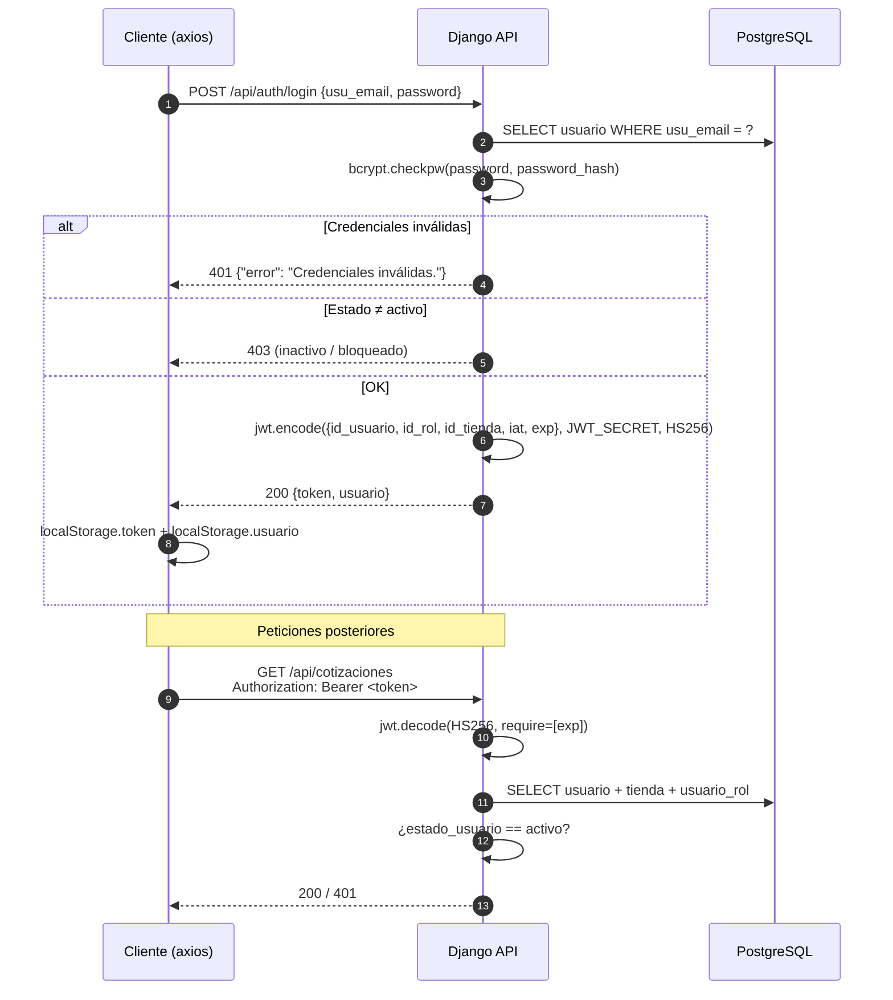

# 08 — Seguridad y Autenticación

## 1. Modelo de autenticación

La API es **stateless por defecto**: el cliente porta un **JWT firmado (HS256)** en cada petición (`Authorization: Bearer <token>`). Las sesiones de Django **sí existen**, pero solo para dos usos puntuales: el panel `/admin/` y el puente del DRF navegable (§1-bis). No hay `SessionAuthentication` de DRF: la API nunca acepta la cookie de sesión del admin como credencial.



### Características del token

| Atributo | Valor |
|---|---|
| Algoritmo | **HS256** (`JWT_SECRET`) |
| Claims | `id_usuario`, `id_rol`, `id_tienda`, `iat`, `exp` |
| Vigencia | `JWT_LIFETIME_SECONDS` = **28800 s (8 h)** |
| Envío | Cabecera `Authorization: Bearer <token>` |
| Invalidación | Se rechaza si `exp` venció o si `usuario.estado_usuario ≠ activo` |
| Refresh | **No existe**; hay que volver a iniciar sesión |
| Header de rechazo | `WWW-Authenticate: Bearer` |

> `id_rol` y `id_tienda` se **refrescan desde la BD** en cada request (no se confía en el token para autorizar).

### Puente sesión-JWT del DRF navegable

El DRF navegable no sabe enviar `Bearer`, así que `POST /api/auth/login` guarda además el token y el rol en la **sesión de Django** (`api/views.py:login`). `JWTAuthentication` (`api/authentication.py`) lo reutiliza cuando no hay cabecera `Authorization`, y el navbar (`backend/templates/rest_framework/api.html`) muestra `nombre · rol: X` con botón Salir (`POST /api/auth/logout`, limpia la sesión).

- La vía Bearer **no** exige CSRF (un formulario cross-site no puede fijar esa cabecera); la vía sesión **sí** (`403 CSRF Failed` sin token, igual que `SessionAuthentication`).
- El token nunca se pinta en el HTML: vive en la sesión del servidor.
- `GET /api/auth/login` existe solo para mostrar el formulario en el navegador.

## 2. Protección de contraseñas

| Aspecto | Implementación |
|---|---|
| Algoritmo | **bcrypt** con `gensalt(rounds=12)` (`api/security.py` / `views.py`) |
| Almacenamiento | Columna `usuario.password_hash` (nunca la contraseña en claro) |
| Validación | Mínimo **8** caracteres en registro y restablecimiento |
| Recuperación | Token aleatorio → se guarda solo su **SHA-256** en `reset_token`, caduca en **1 hora** |
| Verificación de correo | `verificacion_token` aleatorio + `email_verificado` |

## 3. Matriz de roles y permisos

### Roles (UUIDs fijos)

| Rol | UUID | Alcance |
|---|---|---|
| Administrador | `11111111-0000-0000-0000-000000000001` | Todo el panel + catálogo, usuarios y tienda |
| Vendedor | `11111111-0000-0000-0000-000000000002` | Dashboard, inventario, movimientos, cotizaciones, reportes |
| Cliente | `11111111-0000-0000-0000-000000000003` | Catálogo, configurador, carrito, propias cotizaciones |

### Permisos DRF implementados (`api/security.py`)

| Permiso | Condición | Uso |
|---|---|---|
| `AllowAny` | — | Catálogos (lectura), `health`, auth |
| `IsAuthenticated` | JWT válido | Perfil, cotizaciones (GET/POST) |
| `IsStoreStaff` | rol ADMIN **o** VENDEDOR | Inventario, movimientos, cambio de estado de cotizaciones |
| `IsStoreAdmin` | rol ADMIN | `/api/usuarios`, **escritura de catálogos** (POST/PUT/DELETE de categorías, marcas, modelos, motos, roles, tiendas, modelos 3D, accesorios y compatibilidad) |

### Acceso por endpoint

| Grupo de endpoints | Anónimo | Cliente | Vendedor | Admin |
|---|:-:|:-:|:-:|:-:|
| GET catálogos (categorías, marcas, motos, accesorios, modelos 3D, compatibilidad) | ✔ | ✔ | ✔ | ✔ |
| `health`, `register`, `login`, `forgot/reset-password`, `verificar` | ✔ | ✔ | ✔ | ✔ |
| Escritura de catálogos (POST/PUT/DELETE genéricos) | ✖ | ✖ | ✖ | ✔ |
| Cotizaciones (GET/POST) | ✖ | ✔ (suyas) | ✔ (su tienda) | ✔ (su tienda) |
| Cambio de estado de cotizaciones | ✖ | ✖ | ✔ | ✔ |
| Inventario (GET/POST) y movimientos | ✖ | ✖ | ✔ | ✔ |
| `/api/usuarios` (CRUD) | ✖ | ✖ | ✖ | ✔ |
| `GET/PUT /api/tiendas/:id` | ✖/🔑 | ✖/🔑 | ✖/🔑 | ✔ |

✅ **Resuelto:** la escritura de catálogos exige ahora `IsStoreAdmin`; los clientes y vendedores reciben **403** y los anónimos **401**. Queda cubierto por las pruebas de `backend/api/test_endpoints.py`.

> **Nota:** todo permiso depende de que el usuario tenga fila en la tabla `usuario_rol`. El registro público solo crea clientes; para dar de alta el primer administrador (o reparar una tabla vacía) usa el comando `python manage.py asignar_rol --email X --rol admin [--permitir-remoto]`.

## 4. Autorización por tienda (aislamiento de datos)

- `IsStoreStaff`/`IsStoreAdmin` verifican el rol; además, las vistas **filtran por `request.user.id_tienda`**:
  - `GET /inventario` → inventario de **su** tienda.
  - `GET /cotizaciones` → staff: su tienda; cliente: solo las suyas.
  - `PUT /cotizaciones/:id/estado` → `select_for_update()` sobre la cotización **de su tienda** (404 si no).
  - `GET/PUT/DELETE /usuarios/:id` → limitado a su tienda.
- La baja de usuarios es **soft delete** (`estado_usuario = "bloqueado"`); el registro físico nunca se elimina.

## 5. Protecciones de integridad y concurrencia

| Mecanismo | Dónde |
|---|---|
| `SELECT ... FOR UPDATE` | Movimientos de inventario y cambio de estado de cotizaciones |
| Restricción de stock ≥ 0 | `POST /inventario/movimiento` → 400 |
| `UNIQUE` en BD | `usuario.usu_email`, `tienda.nit`, `producto.codigo_sku`, `(tienda, producto)` en inventario, `(accesorio, modelo_moto)` en compatibilidad → 409 |
| Transacciones | Creación de cotización con su detalle; alta de inventario |
| Límites de plan | `limite_productos` (403 al dar de alta) y `limite_usuarios` (403 al registrar staff) |
| Anti-enumeración | `forgot-password` responde 200 genérico exista o no el correo |

## 6. Transporte y cabeceras

### CORS (`settings.py`)

```python
CORS_ALLOWED_ORIGINS = [
    "http://localhost:5173",
    "https://motopreview.vercel.app",
    # + FRONTEND_ORIGINS (separados por coma)
]
CORS_ALLOWED_ORIGIN_REGEXES = [r"^https://[a-zA-Z0-9-]+\.vercel\.app$"]
CORS_ALLOW_CREDENTIALS = True
CORS_ALLOW_HEADERS   = [...default..., "x-language"]
CORS_EXPOSE_HEADERS  = ["Content-Language"]
```

### `ALLOWED_HOSTS`
`DJANGO_ALLOWED_HOSTS` (default: `localhost,127.0.0.1,.onrender.com,.replit.dev,.repl.co`).
✅ El host de Render ya entra por `.onrender.com`; si el servicio usa otro dominio, defínelo en `DJANGO_ALLOWED_HOSTS`.

### Otros
- `DEBUG=false` por defecto (producción por defecto).
- `SECRET_KEY` obligatoria (`DJANGO_SECRET_KEY`/`SESSION_SECRET`): Django no arranca sin ella.
- Sin `SecurityMiddleware`: no se añaden cabeceras `HSTS`, `X-Frame-Options`, etc. Recomendable agregarlas.

## 7. Internacionalización y privacidad

- Idioma: `?lang=` → header `X-Language` → cookie `mp_lang` → `es` (la API JSON **ignora** `Accept-Language`).
- `TranslatedJSONRenderer` solo traduce claves de mensaje (`error`, `mensaje`, `detail`, `message`), nunca los datos.
- Zona horaria `America/Bogota`.

## 8. Gestión de secretos

| Secreto | Dónde | Observación |
|---|---|---|
| `DJANGO_SECRET_KEY`, `JWT_SECRET` | `backend/.env` | En texto plano; el archivo **ya no está trackeado** (`git rm --cached` + `.gitignore` raíz y de `backend/`) |
| `MOTOPREVIEW_DATABASE_URL` | `backend/.env` | Credenciales de Neon en claro |
| `EMAIL_HOST_PASSWORD` | `backend/.env` | Vacío actualmente |
| `VITE_API_URL` | `frontend/.env.local` | Solo URL pública (no es secreto) |

### Recomendaciones
1. ✅ Hecho: `backend/.env` está fuera del índice de Git y cubierto por los `.gitignore`; solo se versiona `backend/.env.example`. **Rotar** las credenciales si el archivo llegó a publicarse (queda en el historial de commits).
2. Usar el gestor de secrets de Render (variables de entorno de la consola) en producción.
3. Activar SMTP con aplicación de contraseña específica (Gmail/Outlook) o servicio tipo Resend/Postmark.
4. ✅ Parcial: `SecurityMiddleware` ya está en `MIDDLEWARE`; falta configurar `SECURE_SSL_REDIRECT`/`SECURE_HSTS_SECONDS` en producción.
5. Mantener verdes las pruebas de permisos: `python manage.py test api` (incluye `test_endpoints.py` y `test_comandos.py`).

## 9. Admin de Django (`/admin/`)

- `django.contrib.admin` está habilitado para inspeccionar y corregir las tablas (`managed=False`); **no** gestiona los usuarios de la aplicación.
- El superusuario vive en `auth_user` (tabla de Django) y es **independiente** de `usuario`; se crea con `manage.py createsuperuser`. Los JWT de la app **no** autentican en `/admin/`.
- `manage.py migrate` solo crea `auth_*`, `django_content_type`, `django_session` y `django_admin_log`; nunca toca las 21 tablas del negocio.
- En el admin no se exponen `password_hash`, `reset_token`, `verificacion_token` ni el `hash` de los tokens.
- `usuario_rol` no se registra porque el admin no admite claves primarias compuestas; los roles se asignan con `manage.py asignar_rol`.
- **Idioma:** el panel se ve en **español** e **inglés**. Cambia con el selector *Idioma / Language* o añade `?lang=en` a la URL; la preferencia se guarda en la cookie `mp_lang`.
- **Sesiones del panel:** usan la tabla `django_session` y exigen CSRF; los estáticos los sirve WhiteNoise (funciona con `DEBUG=false` y gunicorn).
- **Redirects:** `/admin` → `/admin/` explícito (`APPEND_SLASH=False` desactiva el redirect de Django); entrar directo a `/admin/login/` vuelve a `/admin/` (`LOGIN_URL`/`LOGIN_REDIRECT_URL` en `settings.py`, antes caía en `/accounts/profile/` → 404).

---

**Anterior:** [07 — Vistas del frontend](07-vistas-frontend.md) · **Siguiente:** [09 — Despliegue](09-despliegue.md)
