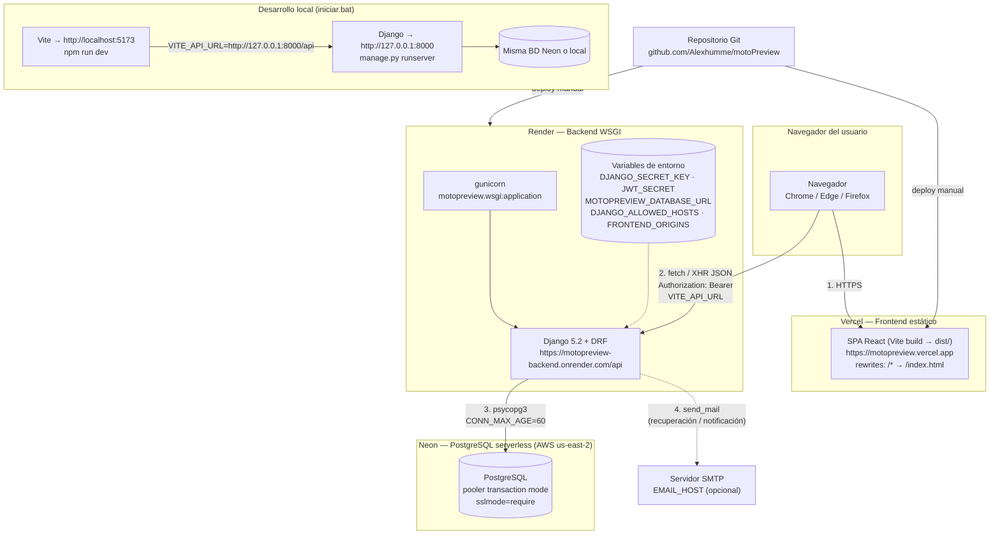

# 09 — Despliegue e Infraestructura

## 1. Arquitectura de despliegue



> Archivo: [`diagramas/despliegue.mmd`](diagramas/despliegue.mmd)

## 2. Entornos

| Entorno | Frontend | Backend | BD | API URL |
|---|---|---|---|---|
| **Desarrollo** | Vite `http://localhost:5173` | `manage.py runserver` `http://127.0.0.1:8000` | Neon (misma) o local | `http://127.0.0.1:8000/api` (creado por `iniciar.bat`) |
| **Producción** | Vercel `https://motopreview.vercel.app` | Render `https://motopreview-backend.onrender.com` (gunicorn) | Neon `us-east-2` | `https://motopreview-backend.onrender.com/api` (default de `config.js`) |

**Cadena de producción:**
```
Navegador → Vercel (SPA estática)
          → axios baseURL = Render /api  (Bearer JWT)
          → Neon PostgreSQL (pooler)
          → SMTP (opcional)
```

## 3. Frontend en Vercel

**`vercel.json`** (todo lo que hay):
```json
{
  "rewrites": [
    { "source": "/(.*)", "destination": "/index.html" }
  ]
}
```

- Solo **rewrites SPA**: no hay `functions`, ni carpeta `api/`, ni build de Python → **Vercel no ejecuta Django**.
- El build por defecto de Vite produce `frontend/dist` (el directorio raíz del proyecto Vercel debe ser `frontend`).
- La variable `VITE_API_URL` debe apuntar a `https://motopreview-backend.onrender.com/api`.
- El regex de CORS del backend acepta cualquier `https://*.vercel.app`, por lo que las previews funcionan automáticamente.

## 4. Backend en Render

| Aspecto | Valor |
|---|---|
| Tipo de servicio | Web Service (contenedor/PM2) **continuo**, no serverless |
| Comando de arranque | `gunicorn motopreview.wsgi:application` (gunicorn está en `requirements.txt`) |
| Build | `pip install -r requirements.txt` |
| Raíz | `backend/` |
| Salud | `GET /api/health` |

### Variables de entorno requeridas en Render

| Variable | Obligatoria | Notas |
|---|:-:|---|
| `DJANGO_SECRET_KEY` (o `SESSION_SECRET`) | ✅ | Django no arranca sin ella |
| `JWT_SECRET` | ✅ | Firma de tokens (fallback: `SESSION_SECRET`) |
| `MOTOPREVIEW_DATABASE_URL` | ✅ | `postgresql://...` (Neon pooler, `sslmode=require`) |
| `DJANGO_ALLOWED_HOSTS` | ✅ | Debe incluir `motopreview-backend.onrender.com` |
| `FRONTEND_ORIGINS` | recomendado | `https://motopreview.vercel.app` (aunque ya está fijo en CORS) |
| `DEBUG` | — | `false` |
| `JWT_LIFETIME_SECONDS` | — | `28800` |
| `DB_CONN_MAX_AGE` | — | `60` |
| `EMAIL_HOST`, `EMAIL_PORT`, `EMAIL_USE_TLS`, `EMAIL_HOST_USER`, `EMAIL_HOST_PASSWORD`, `DEFAULT_FROM_EMAIL` | para correos | SMTP |
| `PASSWORD_RESET_URL` | para correos | `https://motopreview.vercel.app/restablecer` |
| `EMAIL_VERIFICATION_URL` | para correos | `https://motopreview.vercel.app/verificar` |

> Si `MOTOPREVIEW_DATABASE_URL` falta o es de otro esquema (no `postgres|postgresql`), `DATABASES` queda vacío y toda vista responde **503**.

## 5. Base de datos

| Aspecto | Detalle |
|---|---|
| Proveedor | **Neon** (PostgreSQL serverless) |
| Región | `us-east-2` (AWS) |
| Modo | **Pooler** (`ep-...-pooler...neon.tech`) → transacción/pooling, compatible con plataformas serverless |
| Seguridad | `sslmode=require&channel_binding=require` |
| Driver | `psycopg[binary]` 3.x |
| Conexión | `CONN_MAX_AGE=60` (conexiones persistentes) |
| Migraciones | **No usa Django migrations** (`managed=False`): el esquema se administra con SQL directo |
| Seed | `python manage.py seed_demo [--cantidad N] [--borrar] [--permitir-remoto]` — solo permite escribir si el host es local |
| Roles | `python manage.py asignar_rol --listar` / `--email X --rol admin|vendedor|cliente [--crear --nombre ... --password ... --tienda ...]` — llena `usuario_rol` (el registro público solo crea clientes); mismo guardado `--permitir-remoto` en BD remota |
| Admin Django | `python manage.py migrate` crea **solo** las tablas `auth_*`, `django_content_type`, `django_session` y `django_admin_log` que necesita `/admin/`; el superusuario es independiente de la tabla `usuario` |

## 6. Puesta en marcha local

### Opción A — `iniciar.bat` (Windows)
1. Verifica `python` y `npm` en el PATH; exige `backend\.env` (copiar de `.env.example`).
2. Crea `backend/venv` e instala `requirements.txt` si faltan módulos.
3. Ejecuta `npm install` en `frontend/` si falta `node_modules`; crea `frontend/.env.local` con `VITE_API_URL=http://127.0.0.1:8000/api`.
4. Abre **dos ventanas**: backend (`runserver`) y frontend (`npm run dev`).
5. Tras 6 s abre `http://localhost:5173`.

### Opción B — dos terminales
```bash
# Terminal 1 — backend
cd motoPreview/backend
python -m venv venv
venv\Scripts\activate          # Windows
pip install -r requirements.txt
python manage.py check
python manage.py migrate                 # tablas auth_*/django_* para /admin/
python manage.py createsuperuser         # usuario del panel /admin/
python manage.py collectstatic --noinput # estáticos del admin (WhiteNoise)
python manage.py runserver

# Terminal 2 — frontend
cd motoPreview/frontend
npm install
npm run dev
```

### Verificación
```bash
curl http://127.0.0.1:8000/api/health
# {"ok": true, "database_configured": true}
```

## 7. CI/CD

- **CI sí existe**: `.github/workflows/ci.yml` se ejecuta en cada *push* a `main` y en cada *pull request*:
  - `backend`: instala requisitos → `python manage.py check` → `python manage.py test api` (72 pruebas sin BD).
  - `frontend`: `npm ci` → `npm run lint` → `npm run build`.
  - Usa solo secretos ficticios (`DJANGO_SECRET_KEY`, `JWT_SECRET` de CI); no toca la BD.
- Los despliegues a producción siguen siendo **manuales** desde las consolas de Vercel y Render (conectadas al repo `github.com/Alexhumme/motoPreview`, rama `main`).

### Recomendaciones de mejora
1. `Dockerfile` por servicio para eliminar diferencias entre entornos.
2. Despliegue automático en Render al hacer push a `main` y *preview deployments* en Vercel por rama.
3. `render.yaml` (IaC) para reproducir el servicio.
4. Ampliar el CI con una BD de prueba (PostgreSQL en el workflow) para tests de endpoints reales.

## 8. Rendimiento y escalabilidad

| Tema | Estado actual |
|---|---|
| Frontend | CDN de Vercel, assets cacheados por hash |
| Backend | WSGI continuo (gunicorn); escala vertical o por réplicas en Render |
| BD | Pooler de Neon + `CONN_MAX_AGE=60` |
| API | Sin caché; paginación de servidor **opcional** (`?pagina=`/`?por_pagina=`; por defecto sigue devolviendo el listado completo) |
| 3D | `useGLTF` cachea modelos en `THREE.Cache`; los GLTF deben estar en un CDN/CORS habilitado |
| Salud | Sondeo cada 10 s desde el cliente (costo mínimo) |

---

**Anterior:** [08 — Seguridad](08-seguridad.md) · **Siguiente:** [10 — Guía del desarrollador](10-guia-desarrollador.md)
